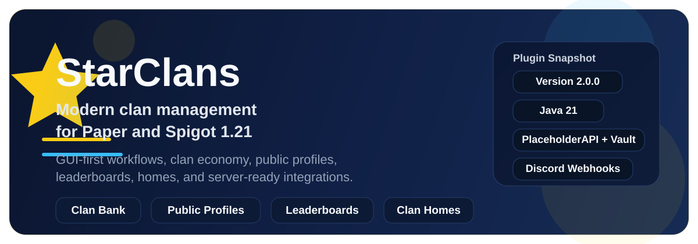

<p align="center">
  
</p>

<p align="center">
  <a href="https://hub.star-dev.xyz/starclans"></a>
  
  
  
  
</p>

<p align="center">
  
  
  
  
  
  
</p>

<p align="center">
  <a href="#overview"></a>
  <a href="#installation"></a>
  <a href="#commands"></a>
  <a href="#placeholders"></a>
  <a href="#configuration"></a>
</p>

## Overview

StarClans is a modern clan plugin for Paper and Spigot `1.21` that puts the whole clan lifecycle into polished GUIs and clean command flows. It covers clan creation, invites, member management, clan chat, public profiles, leaderboards, clan homes, a shared bank, tax handling, PlaceholderAPI output, and Discord webhook notifications.

It is built for servers that want clan systems to feel like a real feature set instead of a pile of single-purpose commands.

## Release Focus

Version `2.0.0` adds the systems that were still missing from the old README:

| Area | What landed |
| --- | --- |
| Clan economy | Shared clan bank, deposit and withdraw flows, `all` actions, GUI quick amounts, and persistent history |
| Tax system | Configurable clan tax rate with bank integration and PlaceholderAPI output |
| Public profiles | Openable clan profile pages with recruiting flow and optional leaderboard entry points |
| Leaderboards | GUI leaderboard with sorting by balance or member count |
| Clan home | `/clan home` and `/clan sethome` with configurable costs and role requirements |
| Integrations | Discord webhook events, Vault economy support, language files, and admin reload flow |

## Feature Stack

| System | Included |
| --- | --- |
| Clan UX | Main menu, create menu, invites menu, members list, member management, settings menu |
| Identity | Styled clan tags, chat suffixes, formatted placeholders, and role-aware presentation |
| Communication | Clan chat toggle and public profile based recruiting |
| Economy | Clan bank, tax handling, balance tracking, quick-amount actions, and transaction history |
| Progression | Leaderboards, public profiles, and role-based access control for critical actions |
| Infrastructure | MySQL / MariaDB persistence through HikariCP, reload support, logging, and update checks |

## Requirements

- Java `21`
- Paper or Spigot `1.21`
- MySQL or MariaDB for full persistent functionality
- Optional: PlaceholderAPI
- Optional: Vault plus an economy plugin

## Installation

1. Build the jar with Maven.
2. Put the jar into your server `plugins/` folder.
3. Start the server once so StarClans generates its files.
4. Configure `plugins/StarClans/config.yml`.
5. Restart the server.

```bash
mvn clean package
```

Example target location after build:

```text
target/StarClans-2.0.0.jar
```

Optional integrations:

- PlaceholderAPI enables `%starclans_*%` placeholders.
- Vault enables economy formatting plus clan bank deposit and withdraw flows.
- Discord webhooks can mirror clan events into a Discord channel.

## Commands

### Core Clan Flow

| Command | Description |
| --- | --- |
| `/clan` | Open the main clan menu |
| `/clan create` | Open the clan creation GUI |
| `/clan invites` | View invites and join requests |
| `/clan invite <player>` | Invite a player into your clan |
| `/clan join <clan>` | Send a join request to a clan |
| `/clan accept <id>` | Accept an invite or join request |
| `/clan deny <id>` | Deny an invite or join request |
| `/clan leave` | Leave your current clan |
| `/clan disband` | Disband your clan |

### Members And Leadership

| Command | Description |
| --- | --- |
| `/clan members` | Open the members list |
| `/clan members <player>` | Open member management for a specific player |
| `/clan kick <player>` | Remove a member from the clan |
| `/clan promote <player>` | Promote a member |
| `/clan demote <player>` | Demote a member |
| `/clan transfer <player>` | Transfer clan leadership |
| `/clan manage` | Open the leader-only management menu |
| `/clan settings` | Open the settings menu |

### Identity, Profiles, And Ranking

| Command | Description |
| --- | --- |
| `/clan tagstyler` | Open the tag and style editor |
| `/clan chatsuffix <text|clear>` | Set or clear the clan chat suffix |
| `/clan chat` | Toggle clan chat |
| `/clan profile [clan|player]` | Open a public clan profile |
| `/clan top` | Open the leaderboard GUI |
| `/clan leaderboard` | Alias for `/clan top` |

### Economy, Tax, And Home

| Command | Description |
| --- | --- |
| `/clan bank` | Open the clan bank menu |
| `/clan deposit <amount|all>` | Deposit money into the clan bank |
| `/clan withdraw <amount|all>` | Withdraw money from the clan bank |
| `/clan tax <percent>` | Set the clan tax rate |
| `/clan home` | Teleport to the clan home |
| `/clan sethome` | Set the clan home location |

### Admin

| Command | Description |
| --- | --- |
| `/starclans help` | Show admin help |
| `/starclans version` | Show the installed plugin version |
| `/starclans reload` | Reload config, language, Vault hook, and database setup |

Aliases:

- `/clans`
- `/clan tagstyle`
- `/clan styler`
- `/clan suffix`
- `/sc`

## Permissions

| Permission | Description | Default |
| --- | --- | --- |
| `starclans.admin.reload` | Allows `/starclans reload` | `op` |

## Placeholders

Identifier: `starclans`

| Placeholder | Description |
| --- | --- |
| `%starclans_name%` | Clan name |
| `%starclans_name_formatted%` | Clan name with member count formatting |
| `%starclans_tag%` | Raw clan tag |
| `%starclans_role%` | Member role |
| `%starclans_members%` | Clan member count |
| `%starclans_invites%` | Open invite count |
| `%starclans_in_clan%` | `true` or `false` |
| `%starclans_balance%` | Clan bank balance |
| `%starclans_balance_formatted%` | Economy-formatted clan bank balance |
| `%starclans_tax%` | Clan tax rate |
| `%starclans_tax_formatted%` | Clan tax rate with percent suffix |
| `%starclans_suffix%` | Styled clan suffix |
| `%starclans_formatted_suffix%` | Styled clan suffix with a leading space when present |

## Configuration

The most important config sections at a glance:

| Section | Purpose |
| --- | --- |
| `database` | Database connection and HikariCP pool settings |
| `clan.creation` | Clan creation costs plus name and tag limits |
| `clan.invite` | Invite expiration and cooldown handling |
| `clan.joinRequest` | Cooldown for recruiting requests |
| `clan.bank` | Enable state, withdraw role, history, and quick amounts |
| `clan.home` | Costs and minimum roles for home set and teleport |
| `clan.chat.suffix` | Suffix permissions, visibility, length, and color options |
| `clan.profile` | Public profile visibility, recruiting, officer preview, and date format |
| `clan.tax` | Tax notification behavior |
| `leaderboard` | Amount of clans shown in the leaderboard GUI |
| `discord.webhook` | Webhook URL, avatar, role mention, timeout, and event toggles |
| `lang` | Selected language file |

Example excerpt:

```yaml
clan:
  bank:
    enabled: true
    withdraw:
      minRole: "OFFICER"
    history:
      enabled: true
      maxEntriesPerClan: 200
      pageSize: 14
  home:
    setCost: 5000.0
    teleportCost: 0.0
    minRoleSet: "OFFICER"
    minRoleTeleport: "MEMBER"
  profile:
    enabled: true
    openFromLeaderboard: true
    showBalance: true
    showTax: true
    recruiting:
      enabled: true
```

## Build

```bash
mvn clean package
```

## Credits

Created by Eministar.
